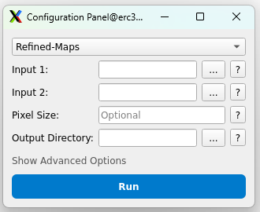
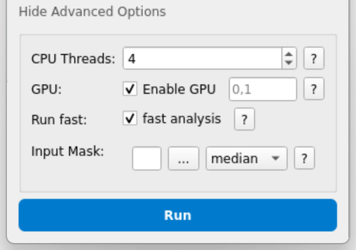

# Instructions for RESOLVE usage and tutorial

## Installation

See [README](README.md)

## Table of Contents

### 1. [Usage](#usage)
- [1.1 GUI mode](#gui-mode)
- [1.2 Command line mode](#command-line-mode)

### 2. [Tutorial on test dataset](#tutorial-on-test-dataset)
- [2.1 SPA map with command-line processing](#spa-map-with-command-line-processing)
- [2.2 Micrograph dataset with command-line batch processing](#micrograph-dataset-with-command-line-batch-processing)
- [2.3 Notes about tilt-series and tomogram batch processing](#notes-about-tilt-series-and-tomogram-batch-processing)

---

## Usage

GUI mode is convenient for processing a single pair of half-maps. Command line mode also offers a batch processing mode, allowing RESOLVE to run on a complete dataset and producing a summary output file.

### GUI mode

Activate conda environment:
```bash
conda activate RESOLVE_env
```

Open graphical user interface (GUI) from anywhere:
```bash
python /yourPath/RESOLVE_GUI.py
```

The GUI should appear now:



On the top, the drop-down menu offers 4 processing options:
- `Refined-Maps` (referring to SPA/STA maps)
- `Micrographs`
- `Tilt-series`
- `Tomograms`

Please make sure to always choose the correct option before you proceed - wrong input types are not necessarily caught and will lead to incorrect results!

**`Input 1`** and **`Input 2`** refer to the input half-map pair.

**`Pixel Size`** should be read from the header - if this is not correct, please input the correct pixel size here!

**`Output Directory`** Choose where to save the results.

There are a few advanced processing options (opened when clicking `Show Advanced Options`):



**`CPU Threads`** Specify number of CPU threads. Usually, 4 should be fine.

**`GPU`** Choose whether to enable GPU processing or not, and option to choose GPUs. For micrographs, GPU mode is not recommended. Otherwise, GPU usage will make processing usually much faster. Probably 2 GPUs maximize efficiency for most cases.

**`Run fast`** Possibly less accurate, but faster - lower sampling in Fourier space (fewer resolutions checked) and real space (increased step size). Requires also less memory.

**`Input Mask`** This is meant to provide flexibility for median (global) resolution estimations for micrographs, tilt-series or tomograms. The mask should have the same dimensions as the input maps, allowing to focus the global measurements on a specific region of interest. Additionally, the mean may be chosen instead of the median.

### Command line mode

Activate conda environment:
```bash
conda activate RESOLVE_env
```

Go into help mode to find all available processing options:
```bash
python RESOLVE.py --help
```

All options previously described for the GUI are also available for command-line processing. Additionally, there is a batch processing mode.

To activate the batch processing mode, use the argument `--mode batch` (instead of `--mode single`)

RESOLVE now does not require the two half-maps as input (`--input1` and `--input2`). Instead, please provide an input directory (`--inputDir`) where all the half-maps of your dataset are located. Then, provide a unique identifier via `--odd_id` and `--even_id`, for example `ODD` and `EVN` or `half1` and `half2`. RESOLVE expects both half-maps to be named identically apart from this identifier.

---

## Tutorial on test dataset

### SPA map with command-line processing

Navigate to tutorial_data:
```bash
cd tutorial_data
```

Run RESOLVE from command line:
```bash
python ../RESOLVE.py --mode single --config "Refined-Maps" --input1 STA/emd_34658_half_map_1.map --input2 STA/emd_34658_half_map_2.map --outputDir STA_output --gpu_enabled
```

The output can be found in the newly created STA_output directory. Note that both `map` as well as `mrc` endings should work.

### Micrograph dataset with command-line batch processing

Navigate to tutorial_data:
```bash
cd tutorial_data
```

Run RESOLVE from command line:
```bash
python ../RESOLVE.py --mode batch --config "Micrographs" --inputDir micrographs --odd_id ODD --even_id EVN --outputDir micrograph_batch_output
```

For faster processing, add the `--fast` option:
```bash
python ../RESOLVE.py --mode batch --config "Micrographs" --inputDir micrographs --odd_id ODD --even_id EVN --outputDir micrograph_batch_output --fast
```

For micrographs, the `--gpu_enabled` flag usually slows down processing and is not necessary!

The output can be found in the newly created micrograph_batch_output directory. For each input micrograph half-map pair, there will be an output .mrc file, an output .png file and a *q*-value plot (with the median *q*-value per resolution). Note that the cutoff for median (global) resolution determination is at *q* = 0.05. Note also the summary.tsv file, the summarized and sorted output for the median (global) resolution for all input micrographs.

### Notes about tilt-series and tomogram batch processing

For tilt-series and tomograms, please adjust the `--config` option accordingly to either `--config Tilt-series` or `--config Tomograms`. Always add the `--gpu_enabled` flag, otherwise processing may take very long. Consider using the `--fast` flag if you have a large dataset to further speed up processing.
